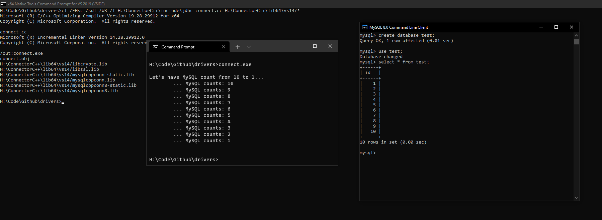

# Drivers
## SQL and Mongo Clients.
The dll's are included in the repository; same as the Sqlite repo. 
MySQL's installed was compiled with x64. To use x86 reinstall or install in x86. 
You have to use the right compiler. I accidently used x86 while using x64 libs. 
Below is the C++ Driver in action! 
x86 location = program files (x86) 
x64 location = program files 
The connector's folders can be moved/were moved in this example.
# Flags:
    cl /EHsc /sdl /W3 /I H:\ConnectorC++64\include\jdbc connect.cc H:\ConnectorC++64\lib64\vs14\*   = 64BIT
    cl /EHsc /sdl /W3 /I H:\ConnectorC++86\include\jdbc connect.cc H:\ConnectorC++86\lib\vs14\*     = x86/32BIT

